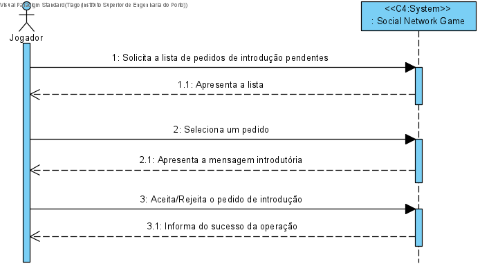
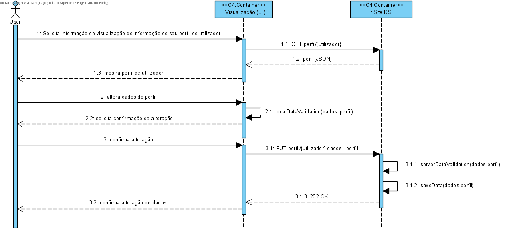
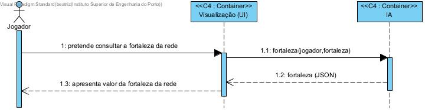
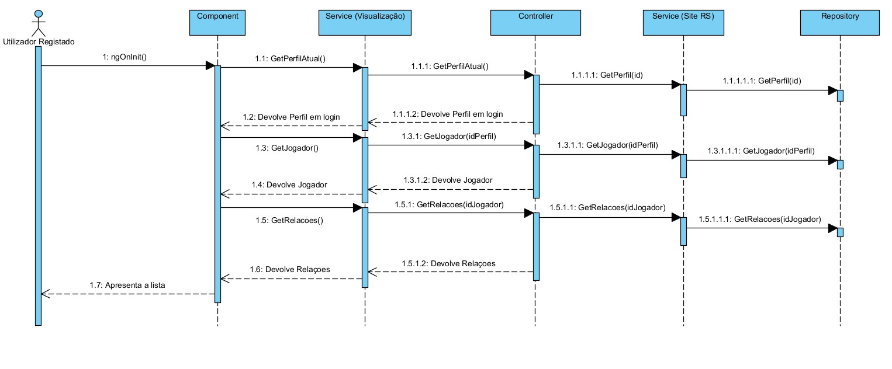

## Contents
- [Views](#Views)
	- [Introduction](#introduction)
	- [Nível 1](Views.md##Nível 1)
		- [Vista Lógica](#vista-lógica)
		- [Vista de Processos](#vista-de-processos)
			- [SSD UC3](#ssd-us03)
			- [SSD UC4](#ssd-us04)
			- [SSD UC5](#ssd-us05)
			- [SSD UC6](#ssd-us06)
			- [SSD UC7](#ssd-us07)
			- [SSD UC8](#ssd8-us08)
			- [SSD UC9](#ssd9-us09)
			- [SSD UC10](#ssd-us10)
			- [SSD UC11](#ssd-us11)
			- [SSD UC12](#ssd-us12)
			- [SSD UC13](#ssd-uc13)
			- [SSD UC14](#ssd-us14)
			- [SSD UC15](#ssd-us15)
			- [SSD UC16](#ssd-us16)
			- [SSD UC17](#ssd-us17)
			- [SSD UC18](#ssd-us18)
			- [SSD UC19](#ssd-us19)
			- [SSD UC20](#ssd-us20)
			- [SSD UC21](#ssd-us21)
			- [SSD UC22a](#ssd-us22a)
			- [SSD UC22b](#ssd-us22b)
			- [SSD UC23](#ssd-us23)
			- [SSD UC24](#ssd-us24)
			- [SSD UC25](#ssd-us25)
			- [SSD UC26](#ssd-us26)
			- [SSD UC27](#ssd-us27)
			- [SSD UC28](#ssd-us28)
			- [SSD UC33](#ssd35-us33)
			- [SSD UC35](#ssd35-us35)
	- [Nível 2](#nível-2)
		- [Vista Lógica](#vista-lógica-1)
		- [Vista de Processos](#vista-de-processos-1)
			- [SD UC3](#sd3-us03)
			- [SD UC4](#sd4-us04)
			- [SD UC5](#sd5-us05)
			- [SD UC6](#sd6-us06)
			- [SD UC7](#sd7-us07)
			- [SD UC8](#sd8-us08)
			- [SD UC9](#sd9-us09)
			- [SD UC10](#sd10-us10)
			- [SD UC11](#sd11-us11)
			- [SD UC12](#sd12-us12)
			- [SD UC13](#sd13-uc13)
			- [SD UC14](#sd14-us14)
			- [SD UC15](#sd15-us15)
			- [SD UC16](#sd16-us16)
			- [SD UC17](#sd17-us17)
			- [SD UC18](#sd18-us18)
			- [SD UC19](#sd19-us19)
			- [SD UC20](#sd20-us20)
			- [SD UC21](#sd21-us21)
			- [SD UC22a](#sd22a-us22a)
			- [SD UC22b](#sd22b-us22b)
			- [SD UC23](#sd23-us23)
			- [SD UC24](#sd24-us24)
			- [SD UC25](#sd25-us25)
			- [SD UC26](#sd26-us26)
			- [SD UC27](#sd27-us27)
			- [SD UC28](#sd28-us28)
			- [SD UC33](#sd33-us33)
			- [SD UC35](#sd35-us35)
		- [Vista de Implementação](#vista-de-implementação)
		- [Vista Física](#vista-física)
	- [Nível 3](#nível-3)
		- [Vista de Processos](#vista-de-processos-1)
			- [SD UC3](#sd3-us03)
			- [SD UC4](#sd4-us04)
			- [SD UC5](#sd5-us05)
			- [SD UC6](#sd6-us06)
			- [SD UC7](#sd7-us07)
			- [SD UC8](#sd8-us08)
			- [SD UC9](#sd9-us09)
			- [SD UC10](#sd10-us10)
			- [SD UC11](#sd11-us11)
			- [SD UC12](#sd12-us12)
			- [SD UC13](#sd13-uc13)
			- [SD UC14](#sd14-us14)
			- [SD UC15](#sd15-us15)
			- [SD UC16](#sd16-us16)
			- [SD UC17](#sd17-us17)
			- [SD UC18](#sd18-us18)
			- [SD UC19](#sd19-us19)
			- [SD UC20](#sd20-us20)
			- [SD UC21](#sd21-us21)
			- [SD UC22a](#sd22a-us22a)
			- [SD UC22b](#sd22b-us22b)
			- [SD UC23](#sd23-us23)
			- [SD UC24](#sd24-us24)
			- [SD UC25](#sd25-us25)
			- [SD UC26](#sd26-us26)
			- [SD UC27](#sd27-us27)
			- [SD UC28](#sd28-us28)
			- [SD UC33](#sd33-us33)
			- [SD UC35](#sd35-us35)
	- [Nível 3 (Site RS)](#nível-3-rs)
		- [Vista Lógica](#vista-lógica-3)
		- [Vista de Implementação](#vista-de-implementação-3)
		- [Vista Física](#vista-física-1)
	- [Nível 3 (UI)](#nível-3-ui)
		- [Vista Lógica](#vista-lógica-3)
		- [Vista de Implementação](#vista-de-implementação-2)
		- [Vista Física](#vista-física-2)
	- [Nível 3 (IA)](#nível-3-ia)
		- [Vista Lógica](#vista-lógica-4)
		- [Vista de Implementação](#vista-de-implementação-3)
		- [Vista Física](#vista-física-3)
	- [Nível 3 (Master Data Posts)](#nível-3-posts)
		- [Vista Lógica](#vista-lógica-5)
		- [Vista de Implementação](#vista-de-implementação-4)
		- [Vista Física](#vista-física-4)

# Views

## Introduction
Será adotada a combinação de dois modelos de representação arquitetural: C4 e 4+1.

O Modelo de Vistas 4+1 [[Krutchen-1995]](References.md#Kruchten-1995) propõe a descrição do sistema através de vistas complementares permitindo assim analisar separadamente os requisitos dos vários stakeholders do software, tais como utilizadores, administradores de sistemas, project managers, arquitetos e programadores. As vistas são deste modo definidas da seguinte forma:

- Vista lógica: relativa aos aspetos do software visando responder aos desafios do negócio;
- Vista de processos: relativa ao fluxo de processos ou interações no sistema;
- Vista de desenvolvimento: relativa à organização do software no seu ambiente de desenvolvimento;
- Vista física: relativa ao mapeamento dos vários componentes do software em hardware, i.e. onde é executado o software;
- Vista de cenários: relativa à associação de processos de negócio com atores capazes de os espoletar.

O Modelo C4 [[Brown-2020]](References.md#Brown-2020)[[C4-2020]](References.md#C4-2020) defende a descrição do software através de quatro níveis de abstração: sistema, contentor, componente e código. Cada nível adota uma granularidade mais fina que o nível que o antecede, dando assim acesso a mais detalhe de uma parte mais pequena do sistema. Estes níveis podem ser equiparáveis a mapas, e.g. a vista de sistema corresponde ao globo, a vista de contentor corresponde ao mapa de cada continente, a vista de componentes ao mapa de cada país e a vista de código ao mapa de estradas e bairros de cada cidade.
Diferentes níveis permitem contar histórias diferentes a audiências distintas.

Os níveis encontram-se definidos da seguinte forma:
- Nível 1: Descrição (enquadramento) do sistema como um todo;
- Nível 2: Descrição de contentores do sistema;
- Nível 3: Descrição de componentes dos contentores;
- Nível 4: Descrição do código ou partes mais pequenas dos componentes (e como tal, não será abordado neste DAS/SAD).

Pode-se dizer que estes dois modelos se expandem ao longo de eixos distintos, sendo que o Modelo C4 apresenta o sistema com diferentes níveis de detalhe e o Modelo de Vista 4+1 apresenta o sistema de diferentes perspetivas. Ao combinar os dois modelos torna-se possível representar o sistema de diversas perspetivas, cada uma com vários níveis de detalhe.

Para modelar/representar visualmente, tanto o que foi implementado como as ideias e alternativas consideradas, recorre-se à Unified Modeling Language (UML) [[UML-2020]](References.md#UML-2020) [[UMLDiagrams-2020]](References.md#UMLDiagrams-2020).

## Modelo de Domínio

## Nível 1
### Vista Lógica

### Vista de Processos

#### SSD UC3

#### SSD UC4

#### SSD UC5

#### SSD UC6

#### SSD UC7

#### SSD UC8

#### SSD UC9

#### SSD UC10

#### SSD UC11

#### SSD UC12

#### SSD UC13

#### SSD UC14

#### SSD UC16

#### SSD UC17

#### SSD UC18

#### SSD UC19

#### SSD UC20

#### SSD UC21

#### SSD UC22a

#### SSD UC22b

#### SSD UC23

#### SSD UC24

#### SSD UC25

#### SSD UC26

#### SSD UC27

#### SSD UC28

#### SSD UC33

#### SSD UC35

#### (outros SSD arquiteturalmente relevantes)
[...]

## Nível 2
### Vista Lógica

### Vista de Processos

#### SD UC3

#### SD UC4

#### SD UC5

#### SD UC6

#### SD UC7

#### SD UC8

#### SD UC9

#### SD UC10

#### SD UC11

#### SD UC12

#### SD UC13

#### SD UC14

#### SD UC16

#### SD UC17

#### SD UC18

#### SD UC19

#### SD UC20

#### SD UC21

#### SD UC22a

#### SD UC22b

#### SD UC23

#### SD UC24

#### SD UC25

#### SD UC26

#### SD UC27

#### SD UC28

#### SD UC33

#### SD UC35

#### SSD US13 (Porquê esta US?)
TBD

#### (outros SSD arquiteturalmente relevantes)
[...]

### Vista de Implementação

### Vista Física

Uma proposta muito simplificada. 

De facto, deve-se ter em consideração os requisitos não funcionais ["Physical Contraints"](Background.md#Physical_Constraints).

## Nível 3
### Vista de Processos

#### SD UC3

#### SD UC4

#### SD UC5

#### SD UC6

#### SD UC7

#### SD UC8

#### SD UC9

#### SD UC10

#### SD UC11

#### SD UC12

#### SD UC13

#### SD UC14

#### SD UC16

#### SD UC17

#### SD UC18

#### SD UC19

#### SD UC20

#### SD UC21

#### SD UC22a

#### SD UC22b

#### SD UC23

#### SD UC24

#### SD UC25

#### SD UC26

#### SD UC27

#### SD UC28

#### SD UC33

#### SD UC35

## Nível 3 (Site RS)
### Vista Lógica

Vista Lógica baseada numa arquitetura por camadas concêntricas (Onion):

### Vista de Implementação

### Vista Física

## Nível 3 (Visualização (UI))
### Vista Lógica

### Vista de Implementação

### Vista Física

## Nível 3 (IA)
### Vista Lógica

### Vista de Implementação

### Vista Física

## Nível 3 (Master Data Posts)
### Vista Lógica

### Vista de Implementação

### Vista Física

